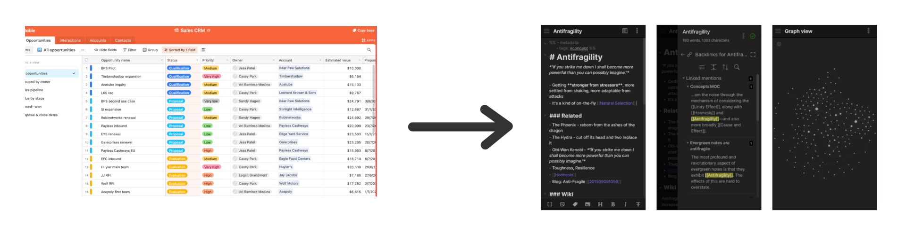

# Airtable2Obsidian
A simple Python script that takes all records from your Airtable, and transforms them into Obsidian ready Markdown files. 



## Why?
Airtable2Obsidian does not just transform Airtable records into simple Markdown, but ensures that tags and links between Airtable records within and across tables are kept, so that when using Obsidian Markdown files are linked and tagged!

## Usage
The script works like this:

- From a Airtable base, each table is transformed into a folder, where each record from the table becomes a separate Markdown file
- The script builds a dictionary of all records in the base, which it uses to make sure that any references to records are transformed into references between Markdown files
- It transforms all records into Markdown, Obsidian ready, files by translating Airtable tags to Obsidian tags, and links between Airtable records to links between Obsidian Markdown files.

You need to change the following values:

Before starting the script, change the below three values which can be found in your Airtable API documentation here: https://airtable.com/developers/web/api/introduction

```
API_KEY = 'api_key_here'
BASE_ID = 'airtable_base_id_here'
TABLE_NAMES = ['tables_here_as_list']
```

Also, in order to provide the linkage between records, the script now assumes that each record has a column called 'Title'. If this is not the case for your Airtable, either change the Airtable or change this in the code (`fields.Title`).
